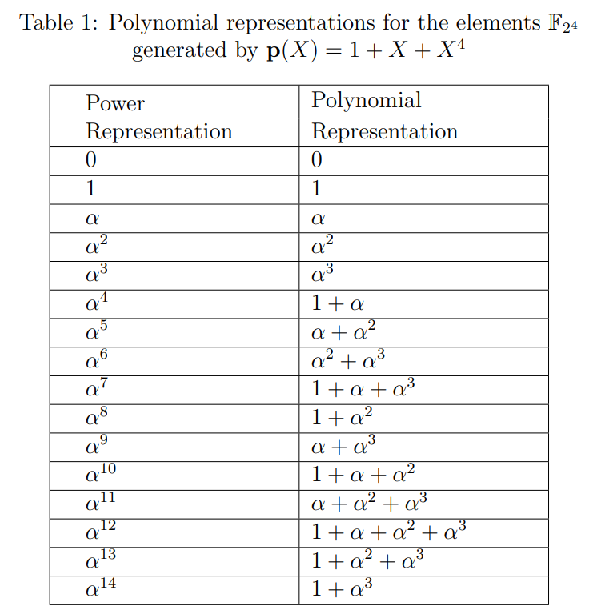
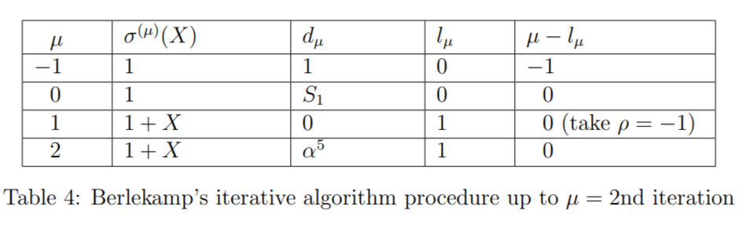
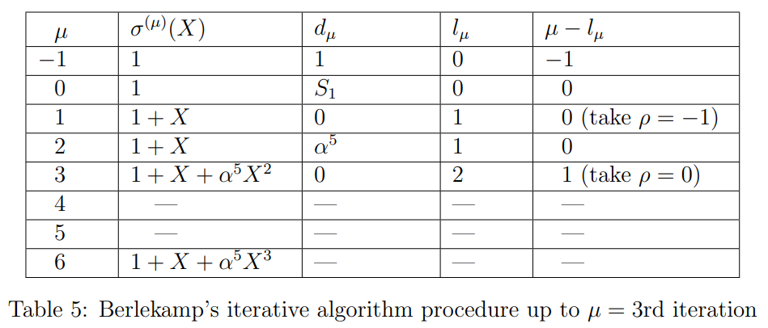

## Theory

In this experiment, we consider a binary primitive BCH code, which is a subclass of binary BCH codes that is one of the most important from the standpoint of both theory and implementation. A detailed discussion of the topics covered in this experiment can be found in [1, Chapter 6]. One of the most important and popular subclass of nonbinary BCH codes is the Reed-Solomon codes, presented in Experiment-7. 

The theory associated with Experiment-9 is divided into two parts:

(1) Preliminaries  
(2) Encoding of Binary Primitive BCH codes
(3) Decoding of Binary Primitive BCH codes

## 1 &nbsp; &nbsp; Preliminaries
In this section, we recall the basics of Galois fields (fields of prime power $\mathbb{F}_{p^{m}}$) and the construction of the minimal polynomial of an element belonging to the Galois field. For more details, students can refer to Experiment-6 (Part-4). 

In this experiment, we are studying only binary BCH code. Therefore, we consider the Galois field with $p=2$, i.e., $ \mathbb{F}_{2^{m}} = \{0, 1, \alpha, \alpha^{2}, \ldots, \alpha^{2^{m}-2} \}$. Here $\alpha$ is the primitive element, which is the root of a primitive polynomial of degree $m$ over $\mathbb{F}_{2}$ and $\alpha^{2^{m}-1} = 1 $. Notice that any non-zero element can be generated by the primitive element $\alpha$ (i.e., $\alpha$ raised to the power of some $i , \,0 \leq i \leq 2^{m}-2$).

For an example all the elements of the field $\mathbb{F}_{2^{4}}$ is provided in Table 1, where $\alpha^{15}=1$. It contains both power and polynomial representations of all elements, which is constructed with the primitive polynomial $ 1 + X + X^{4}$. Therefore, the relation $1+ \alpha + \alpha^{4} = 0$ has been used for polynomial representation. This table will be utilized throughout the experiment wherever it is required. 
 

Binary BCH code of length $n = 2^{m}-1$ is called binary primitive BCH code, since the length of the code is equal to the number of elements generated by the primitive element $\alpha$ in $ \mathbb{F}_{2^{m}} $. for e.g., binary BCH code of length $n=15$ over the field $\mathbb{F}_{2^{4}}$ is binary primitive BCH code, since $n = 15 = 2^{4}-1$.

In Experiment-1 (Part-1), We have seen the definition of the field $\mathbb{F}$ with binary operations addition $(+)$ and multiplication $(.)$. One of the axioms of the field is multiplicative inverse. For every $a \neq 0 \, \in \mathbb{F}$, there exists an element in $\mathbb{F}$, denoted by $a^{-1}$  called the multiplication inverse of $a$, such that $a.a^{-1} =1$. In the later part of the experiment, we will need to find the multiplicative inverses of non-zero elements belonging to $\mathbb{F}_{2^{m}}$. Let's see the method to find the multiplicative inverse of any element for the particular Galois field $\mathbb{F}_{2^{m}}$. The multiplicative inverse of an element $\alpha^{l} $ belongs to $ \mathbb{F}_{2^{m}}$ is the element $\alpha^{l^{'}}$ from $ \mathbb{F}_{2^{m}}$ if and only if $\alpha^{l} \alpha^{l^{'}} = 1$. That implies $\alpha^{l+l^{'}} = 1$, it can happen only if $l+l^{'} = 2^{m}-1$, therefore $\alpha^{l^{'}} = \alpha^{(2^{m}-1)-l}$. For e.g.,\ inverse of $\alpha^{3}$ in the field $ \mathbb{F}_{2^{4}}$ is $\alpha^{15-3} = \alpha^{12}$. 

Minimal polynomials of filed elements are used in finding the generator polynomial of the BCH code. So, now let's see the construction of the minimal polynomial of an element through the following example. 

$\textbf{Example 1:}$ _Consider the Galois field $\mathbb{F}_{2^{4}}$ such that $1+\alpha+\alpha^{4} = 0$ (see Table 1). Suppose we want to determine the minimal polynomial $\phi(X)$ of $\beta = \alpha^{3}$ in $\mathbb{F}_{2^{4}}$. Recall that conjugates of $\beta$ are the distinct elements $\beta^p, \beta^{p^2}, \ldots, \beta^{p^{{m}}} $, where $p$ is the characteristic of $\mathbb{F}_{p^{m}}$ (here $p=2$). So the conjugates of the element $\beta=\alpha^{3}$ are $\alpha^{3.2} = \alpha^{6}, \alpha^{3.2^{2}}=\alpha^{12}$, $\alpha^{3.2^{3}}=\alpha^{9}$ and $\alpha^{3.2^{4}}=\alpha^{3}$. Hence, the minimal polynomial of $\beta = \alpha^{3}$ is_
$$
\begin{align*}
      \phi(X) & = (X+\alpha^{3}) (X+\alpha^{6}) (X+\alpha^{12}) (X+\alpha^{9}) \\
      & = [X^{2}+(\alpha^{3}+\alpha^{6})X+\alpha^{9}] [X^{2}+(\alpha^{12}+\alpha^{9})X+\alpha^{21}]   \\
      & = (X^{2}+\alpha^{2}X+\alpha^{9}) (X^{2}+\alpha^{8} X+\alpha^{6})      \\
      & = X^{4} + (\alpha^{2} + \alpha^{8}) X^{3} + (\alpha^{6}+\alpha^{10}+\alpha^{9}) X^{2} + (\alpha^{17} + \alpha^{8}) X  + \alpha^{15} \\
      & = X^{4} + X^{3} + X^{2} + X +1.
\end{align*}
$$
_We can find the minimal polynomial of every element as shown above. Conjugates of an element_
*  $\alpha$ _are_ $ \{ \alpha, \alpha^{2}, \alpha^{4}$, $\alpha^{8} \}$,
*  $\alpha^{3}$ _are_ $\{ \alpha^{3}, \alpha^{6}, \alpha^{9} $,$\alpha^{12} \}$,
*  $\alpha^{5}$ _are_ $ \{ \alpha^{5} $, $\alpha^{10} \}$ _and_
*  $ \alpha^{7}$ _are_ $ \{ \alpha^{7}, \alpha^{11}, \alpha^{13} $ _and_ $\alpha^{14} \}$.

_The minimal polynomials of $\alpha, \alpha^{3}, \alpha^{5}$ and $\alpha^{7}$ are_
$$
    \begin{align*}
        & \phi_{1}(X) = 1+X+X^{4}, \\
        &  \phi_{3}(X) = 1+X+X^{2}+X^{3}+X^{4}, \\
        & \phi_{5}(X) = 1+X+X^{2}, \,\text{and}\\
        &  \phi_{7}(X) = 1+X+X^{2}+X^{3}+X^{4}
    \end{align*}
$$
_respectively._

## 2 &nbsp; &nbsp; Encoding of Binary Primitive BCH Code

BCH codes form a class of cyclic codes. Suppose we want to design a code that can correct up to $t$ number of errors. In general, finding the generator polynomial to obtain the  $t$ -error-correcting cyclic code is difficult. However, the design of BCH codes involves finding an appropriate generator polynomial, which allows the correction of errors up to $t$. In this section, we will explain the construction of the generator polynomial for a binary primitive BCH code, which can correct up to $t$ errors.

For any positive integers $m (m\geq 3)$ and $t (t < 2^{m-1})$, there exists a binary BCH code with the parameters: block length $n = 2^{m}-1$, number of parity check-check bits $n-k \leq mt $ and minimum distance $d_{min} \geq 2t+1$. This code can correct any combination of $t$ or fewer errors in a block of $n = 2^{m}-1$ bits. From now onwards, in subsequent discussions, we will refer to the binary primitive BCH code as the BCH code. Now we will see the construction of the generator polynomial of $t$ -error-correcting BCH code.
 
 

$\textbf{Construction of Generator Polynomial:}$ The generator polynomial of the BCH code is specified in terms of its roots from the Galois field $\mathbb{F}_{2^{m}}$. Let $\alpha$ be a primitive element in $\mathbb{F}_{2^{m}}$. The generator polynomial $\mathbf{g}(X)$ of the BCH code of length $2^{m}-1$, which can correct up to $t$ errors, is the lowest-degree polynomial over $\mathbb{F}_{2}$ that has $ \alpha, \alpha^{2}, \alpha^{3}, \ldots , \alpha^{2t}$ as it roots. i.e., $\mathbf{g}(\alpha^{i}) = 0 $ for $1 \leq i \leq 2t$. We know that if $\beta$ is the root of the polynomial, then all its conjugates are also the roots of that polynomial. Therefore, $\mathbf{g}(X)$ has $ \alpha, \alpha^{2}, \alpha^{3}, \ldots , \alpha^{2t}$ and their conjugates as all its roots. Let $\phi_{i}(X)$ be the minimal polynomial of $\alpha^{i}$. Then, $\mathbf{g}(X)$ must be the least common multiple (LCM) of $\phi_{1}(X), \phi_{2}(X), \ldots , \phi_{2t}(X)$, that is
$$
\begin{equation}
    \mathbf{g}(X) = \text{ LCM } \{\phi_{1}(X), \phi_{2}(X), \ldots , \phi_{2t}(X) \}.
\end{equation}
$$
Based on the fact that the minimal polynomial of an element and all its conjugates is the same, the generator polynomial can be reduced to 
$$
\begin{equation}
    \mathbf{g}(X) = \text{LCM} \, \, \{\phi_{1}(X), \phi_{3}(X), \phi_{5}(X), \ldots , \phi_{2t-1}(X) \}.
\end{equation}
$$

Now, we can obtain the polynomial representation of the codeword for the given message vector $\mathbf{u}=\begin{bmatrix} u_0& u_1& \ldots& u_{k-1} \end{bmatrix} \in \mathbb{F}_{2}^{k}$ as
$$
\begin{align}
  \mathbf{v}(X) & = \mathbf{u}(X) \mathbf{g}(X) \\
                & =  v_0 + v_1X + v_2X^2 + \ldots + v_{n-1}X^{n-1},
                \nonumber
\end{align}
$$
where $\mathbf{u}(X) = u_0 + u_1X + u_2X^2 + \ldots + u_{k-1}X^{k-1}$ is the polynomial representation of the message $\mathbf{u} \in \mathbb{F}_2^k$. The codeword of $\mathbf{u} \in \mathbb{F}_2^k$ is the vector representation of $\mathbf{v}(X)$, i.e., $\mathbf{v}=\begin{bmatrix} v_0& v_1& \ldots& v_{n-1} \end{bmatrix} \in \mathbb{F}_2^n$.

Now we will illustrate the construction of a generator polynomial with an example (Example 2).

$\textbf{Example 2:}$  _A t-error-correcting BCH code of length 15._

_The length of the code $n= 15 = 2^{m}-1$, that implies $m=4$. Let $\alpha$ be a primitive element of Galois field $\mathbb{F}_{2^{4}}$ such that $1 + \alpha + \alpha^{4} = 0$. Elements of $\mathbb{F}_{2^{4}}$ are given in Table 1._ 

_For $t=1$: From Eq. (2)  the generator polynomial $\mathbf{g}(X) = \text{LCM} \, \, \{\phi_{1}(X) \}.$ Therefore, the minimal polynomial $\phi_1(X)$ is the generator polynomial. The minimum distance of the BCH code $d_{min} \geq 2t+1 = 3$. The generator polynomial $\mathbf{g}(X) = (1+X+X^{4})$ is the minimal degree code polynomial of the code, and the weight of the corresponding codeword is 3. Since $d_{min} \geq 3$ and there is a codeword of weight 3 in the code, hence the $d_{min} = 3$. Therefore, with the above $\mathbf{g}(X)$ we obtain the code $(n=15, k=11, d_{min}=3 )$ which can correct any single error._

For $t=3$: From Eq. (2) the generator polynomial, $\mathbf{g}(X) = \text{LCM} \, \, \{\phi_{1}(X), \phi_{3}(X), \phi_{5}(X) \}$. Because $ \phi_{1}(X), \phi_{3}(X), \phi_{5}(X) $ are three distinct irreducible polynomials.
$$
    \begin{align*}
        \mathbf{g}(X) & = \phi_{1}(X) \phi_{3}(X) \phi_{5}(X) \\
             & = (1+X+X^{4}) (1+X+X^{2}+X^{3}+X^{4}) (1+X+X^{2})  \\
             & = 1+X+X^{2}+X^{4}+X^{5}+X^{8}+X^{10}. 
    \end{align*}
$$
The minimum distance of the code $d_{min} \geq 2t+1 = 7$ and the weight of the codeword corresponding to the code polynomial $\mathbf{g}(X) = 1+X+X^{2}+X^{4}+X^{5}+X^{8}+X^{10} $ is 7, hence $d_{min} = 7$. Therefore, with the above $\mathbf{g}(X)$ we obtain BCH code $(n=15, k=5, d=7 )$, which can correct up to any three errors. Notice that these codes are not MDS codes.

## 3 &nbsp; &nbsp; Decoding of Binary Primitive BCH Code

Suppose that a codeword $\mathbf{v}(X) =  v_0 + v_1X + v_2X^2 + \ldots + v_{n-1}X^{n-1}$ is transmitted over Binary Symmetric Channel (BSC), and the received vector is $\mathbf{r}(X) =  r_0 + r_1X + r_2X^2 + \ldots + r_{n-1}X^{n-1}$. Let $\mathbf{e}(X) =  e_0 + e_1X + e_2X^2 + \ldots + e_{n-1}X^{n-1}$ is the error pattern. Then,
$$
\begin{equation}
    \mathbf{r}(X) = \mathbf{v}(X) + \mathbf{e}(X).
\end{equation}
$$
In Experiment-4 (Part-2), we studied syndrome decoding for linear block codes. The key steps in syndrome decoding consist of computing the syndrome of the received vector and associating it with the error pattern, which is then added to obtain the decoded codeword. Now we will discuss the procedure to find the syndrome of the received vector and its error pattern for the BCH  code.

In a $t$ -error-correcting BCH code, the syndrome can be found from the fact that $\alpha, \alpha^{2}, \ldots, \alpha^{2t}$ are the roots of $\mathbf{g}(X)$ (refer Eq. (2)), i.e., $\mathbf{g}(\alpha^{i})  = 0, \, \forall 1 \leq i \leq 2t $. According to Eq. (3) every  code polynomial $\mathbf{v}(X)  = \mathbf{u}(X) \mathbf{g}(X) $, so for every $1 \leq i \leq 2t $ we get $\mathbf{v}(\alpha^{i})  = \mathbf{u}(\alpha^{i}) \mathbf{g}(\alpha^{i}) = = \mathbf{u}(\alpha^{i}).0 = 0$. Using these $2t$ elements as evaluation points for the received polynomial, the syndrome vector will form with $2t$ components. Let the syndrome vector $\mathbf{S} = \begin{bmatrix} S_1& S_2& \ldots &  S_{2t} \end{bmatrix} $ and its components are $ S_{i} = \mathbf{r}(\alpha^{i}), \, \forall 1 \leq i \leq 2t$. Furthermore, from Eq. (4) we also get $\mathbf{r}(\alpha^{i}) = \mathbf{v}(\alpha^{i}) + \mathbf{e}(\alpha^{i}) = 0 + \mathbf{e}(\alpha^{i}) = \mathbf{e}(\alpha^{i}),$ for all $1 \leq i \leq 2t$. Therefore

$$
\begin{align}
    \mathbf{S}  = \begin{bmatrix}
        S_1& S_2& \ldots&  S_{2t}
    \end{bmatrix} & = \begin{bmatrix}
                    \mathbf{r}(\alpha^{1})&  \mathbf{r}(\alpha^{2})& \ldots &, \mathbf{r}(\alpha^{2t}) 
               \end{bmatrix}  \nonumber \\
               & = \begin{bmatrix}
                   \mathbf{e}(\alpha^{1})& \mathbf{e}(\alpha^{2})& \ldots &\mathbf{e}(\alpha^{2t}) 
               \end{bmatrix}.
\end{align}
$$

Since $S_{i} = \mathbf{e}(\alpha^{i})$ for $1 \leq i \leq 2t $, the syndrome $\mathbf{S}$ depends on the error pattern $\mathbf{e}$ only. Suppose that the error vector $\mathbf{e}$ has $\nu$ errors at locations ${j_{1}}, {j_{2}}, \ldots , {j_{\nu}}$, where $0 \leq j_1 < j_2 < \ldots < j_{\nu} < n$. Then the corresponding error polynomial
$$
\begin{equation}
    \mathbf{e}(X) = X^{j_1}+X^{j_2}+ \ldots + X^{j_{\nu}}.
\end{equation}
$$

From Eq. (5) and Eq. (6) we obtain for every $1 \leq i \leq 2t, \, S_{i} =  (\alpha^{j_1})^{i}+(\alpha^{j_2})^{i}+ \ldots + (\alpha^{j_{\nu}})^{i}$. Since, $j_{l}$'s are unknown, $\alpha^{j_{l}}$'s are also not known. For convenience, let $\beta_{l} = \alpha^{j_{l}}$ for $1 \leq l \leq \nu$. We call these elements the error location numbers. Since by knowing $\beta_{l}$'s, we can tell the location of the errors $j_{l}$. Now we define the following polynomial:
$$
\begin{align}
    \sigma(X) & \triangleq (1+\beta_{1}X) (1+\beta_{2}X) \ldots (1+\beta_{\nu}X) \nonumber \\
    & = \sigma_{0} + \sigma_{1}X+ \sigma_{2}X^{2}+ \ldots + \sigma_{\nu}X^{\nu}. 
\end{align}
$$
The roots of $\sigma(X)$ are $\beta_{1}^{-1}, \beta_{2}^{-1}, \ldots , \beta_{\nu}^{-1}$, which are the inverses of $\beta_{1}= \alpha^{j_{1}}, \beta_{2}= \alpha^{j_{2}}, \ldots , \beta_{\nu}= \alpha^{j_{1}}$. Therefore, by knowing $\beta_{l}^{-1}$ for all $l$ we can find $\beta_{l} = \alpha^{j_{l}}$, thus we get the location of errors $j_{l}$ of $\mathbf{e}$. For this reason, $\sigma(X)$ is called the error-location polynomial. Note that $\sigma(X)$ is an unknown polynomial whose coefficients $\sigma_{l}$'s must be determined. Our decoding strategy is to estimate the codeword that is nearest to the received vector, which is equivalent to finding an error pattern with less number of error locations. Therefore, utilizing the relationship between $\sigma_{l}$'s and syndrome components $S_{i}$'s, we aim to determine $\sigma(X)$ with the lowest possible degree. Because the lowest possible degree will have less number of roots ($\beta_{l}$'s), hence the number of error locations ($j_{l}$'s) are minimum. If $\nu \leq t$, this $\sigma(X)$ will give the actual an error pattern $\mathbf{e}(X)$.

By knowing the polynomial $\sigma(X)$, we can find its roots by substituting the elements from the field $\mathbb{F}_{2^{m}}$. From this, we can find $\beta_{1} = \alpha^{j_1}, \beta_{2} =\alpha^{j_2}, \ldots , \beta_{\nu} = \alpha^{j_{\nu}}$ and $j_{1}, {j_2}, \ldots , j_{\nu}$ are the error location numbers.

Now, we can summarize the error-correcting procedure for BCH codes with three major steps:
1. Compute the syndrome $\mathbf{S}  = \begin{bmatrix} S_1 & S_2 & \ldots & S_{2t}\end{bmatrix} $ from the received polynomial $\mathbf{r}(X)$.
2. Determine the error-location polynomial $\sigma(X)$ from the syndrome components $S_1, S_2, \ldots , S_{2t}$.
3. Determine the error-location numbers $\beta_{1} = \alpha^{j_1}, \beta_{2} =\alpha^{j_2}, \ldots , \beta_{\nu} = \alpha^{j_{\nu}}$ by finding the roots of $\sigma(X)$, and correct the errors in $\mathbf{r}(X)$.

In step 1, computing the syndrome can be done by evaluating the received polynomial at $\alpha^{i}$'s. In step 3, for the given $\sigma(X)$ (obtained from Step 2) the roots $\beta_{l}^{-1}$ of  $\sigma(X)$ can be obtained by substituting all the field elements, from that we can find $\beta_{l} = \alpha^{j_{l}}$ and the corresponding error-location numbers $j_{l}$. Among all the three steps, step 2 is the most complicated part of decoding a BCH code. For step 2, in this experiment, we present one of the iterative algorithms called Berlekamp's iterative algorithm for finding the error-location polynomial $\sigma(X)$. This algorithm has initial state values for $\mu = -1, 0$ rows (see Table 2}). Using these initial rows and the syndrome components $S_{1} \, \&$ $S_{2}$, the first step of iteration $\mu =1$ is to find the minimal degree polynomial $\sigma^{(1)}(X)$ and the entire $\mu=1 th$ row of the table. The next step is to find $\sigma^{(2)}(X)$ and $\mu=2 th$ row. For this, we use the rows $\mu = -1, 0, 1 $, and syndrome components $S_{1}, S_{2} \, \& $  $S_{3}$. This process will continue up to $2t$ iterations. Suppose the algorithm is performed $\mu th$ row, then $(\mu+1) th$ step of iteration is to find the minimum-degree polynomial $\sigma^{(\mu+1)}(X) $ and entire $\mu+1$ th row of the table. Syndrome components $S_1 , S_2, \ldots , S_{\mu+1}$ and the rows up to $\mu$ are used to obtain the $\sigma^{(\mu+1)}(X) $. Now we will see the procedure of Berlekamp's iterative algorithm to get $\sigma^{(\mu+1)}(X) $ in detail.
 
 
$\textbf{Berlekamp's iterative algorithm:}$ If the number of errors in the received polynomial $\mathbf{r}(X)$ are $t$ or less, then $\sigma(X)$ produces the true error pattern. Let 
$$
\begin{equation}
     \sigma^{(\mu)}(X)  = 1 + \sigma^{(\mu)}_{1}X+ \sigma^{(\mu)}_{2}X^{2}+ \ldots + \sigma^{(\mu)}_{l_{\mu}}X^{l_{\mu}}
\end{equation}
$$
be the minimum-degree polynomial determined at the $\mu$th step of the iteration. Here $l_{\mu}$ is the degree of $\sigma^{(\mu)}(X)$ and $\sigma^{(\mu)}_{j} $ is the coefficient of $X^{j}$ for $j= 0,1,2, \ldots ,l_{\mu}$. 

To carry out the iteration of finding $ \sigma(X) $, we begin with Table \ref{Table:Berlekamp_algorithm} and proceed to fill out the table, where $ l_{\mu} $ is the degree of $\sigma^{(\mu)}(X)$ and $d_{\mu}$ is called the $\mu th$ discrepancy. Assuming that we have filled out all rows up to and including the $\mu th$ row, we fill out the $(\mu+1) th$ row as follows:

1. If $d_{\mu} = 0 $, then  
$$
    \begin{equation}
        \sigma^{(\mu+1)}(X) = \sigma^{(\mu)}(X), \, \text{and} \,\, l_{\mu+1} = l_{\mu}.
    \end{equation}
$$        
2. If $d_{\mu} \neq 0$, we find another row $\rho$ prior to the $\mu$th row such that $d_{\mu} \neq 0$ and the number $\rho - l_{\rho}$ in the last column of the table has the largest value. Then, $\sigma^{(\mu+1)}(X)$ is 
$$
    \begin{equation}
        \sigma^{(\mu+1)}(X) = \sigma^{(\mu)}(X) + d_{\mu} d_{\rho}^{-1} X^{(\mu - \rho)} \sigma^{(\rho)}(X),
    \end{equation}
$$
and 
$$
\begin{equation}
    l_{\mu +1} = \max(l_{\mu}, l_{\rho} + \mu -\rho ).
\end{equation}
$$
In either case, 
$$
\begin{equation}
    d_{\mu+1} = S_{\mu+2} + \sigma_{1}^{(\mu+1)} S_{\mu+1} + \ldots + \sigma^{(\mu+1)}_{l_{\mu+1}},
\end{equation}
$$
where the $\sigma_{i}^{(\mu+1)}$'s are the coefficients of $\sigma^{(\mu+1)}(X)$. The polynomial $\sigma^{(2t)}(X)$ in the last row should be the required $\sigma(X)$. If its degree is greater than $t$, there are more than $t$ errors in the received polynomial $\mathbf{r}(X)$, then there will be a decoding error. Because the roots of the obtained $\sigma(X)$ don't provide the correct error locations of the received vector.
 

Now, we decode the codeword of the received vector given in the following example, which can be divided into three major steps as discussed earlier.

$\textbf{Example 3:}$ _Consider the $(15, 5, 7)$ triple-error-correcting BCH code given in the Example 2. Suppose that $\mathbf{v} = [0, 0, 0, 0, 0, 0, 0, 0, 0, 0, 0, 0, 0, 0, 0]$  
is transmitted, and the vector $\mathbf{r} = [0, 0, 0, 1, 0, 1, 0, 0, 0, 0, 0, 0, 1, 0, 0]$ is received. Then $\mathbf{r}(X) = X^{3}+X^{5}+X^{12}$. The step-by-step decoding process of $\mathbf{r}(X)$ is explained below:_
 
 

$\textbf{Step 1:}$ _We find the syndrome vector of the received polynomial from Eq. (5),_
$$
    \begin{align*}
        \mathbf{S} & = \begin{bmatrix}
            S_1& S_2& S_3& S_4&  S_5& S_{6}
        \end{bmatrix},  \nonumber \\
        & = \begin{bmatrix}
            \mathbf{r}(\alpha^{1})& \mathbf{r}(\alpha^{2})& \mathbf{r}(\alpha^{3}), \mathbf{r}(\alpha^{4})& \mathbf{r}(\alpha^{5})& \mathbf{r}(\alpha^{6})
        \end{bmatrix}.
    \end{align*}
$$

_For this example, for $1 \leq i \leq  2t $, $\mathbf{r}(\alpha^{i}) = \alpha^{3i}+\alpha^{5i}+\alpha^{12i} $ can be found by using Table 1. Let's look at the evaluation of the received polynomial $\mathbf{r}(\alpha^{i})$ for $i = 1, 2, 3$:_

$$
\begin{align*}
      \mathbf{r}(\alpha) & = \alpha^{3} + \alpha^{5} + \alpha^{12} \\
                         & = \alpha^{3} + (\alpha +\alpha^{2}) + (1+\alpha+\alpha^{2}+\alpha^{3})     \\
                         & = 1.
\end{align*} 
$$
$$
\begin{align*}
    \mathbf{r}(\alpha^{2}) & = \alpha^{6} + \alpha^{10} + \alpha^{24} \\
                             & = \alpha^{6} + \alpha^{10} + \alpha^{9} \\
                         & = (\alpha^{2}  + \alpha^{3} )+ (1+\alpha+\alpha^{2}) + (\alpha +\alpha^{3})      \\
                         & = 1.
\end{align*} 
$$
$$
\begin{align*}
  \mathbf{r}(\alpha^{3}) & = \alpha^{9} + \alpha^{15} + \alpha^{36}  \\
                             & = \alpha^{9} + 1 + \alpha^{6}  \\
                         & = (\alpha  + \alpha^{3} )+  1  + (\alpha^{2} +\alpha^{3}) \quad \quad \quad \quad \quad   \\
                         & = \alpha^{10}.
\end{align*}    
$$
_Similarly, we can find for $i = 4, 5, 6$. The syndrome vector_
$$
    \begin{align*}
        \mathbf{S} & = \begin{bmatrix}
            S_1 & S_2 & S_3 & S_4 & S_5 & S_{6}
        \end{bmatrix}, \\
        & = \begin{bmatrix}
            \mathbf{r}(\alpha^{1}) & \mathbf{r}(\alpha^{2}) & \mathbf{r}(\alpha^{3}) & \mathbf{r}(\alpha^{4}) & \mathbf{r}(\alpha^{5}) & \mathbf{r}(\alpha^{6})
        \end{bmatrix}, \\
        & = \begin{bmatrix}
            1 & 1 &  \alpha^{10} & 1 & \alpha^{10} & \alpha^{5} 
        \end{bmatrix}.
    \end{align*}
$$

_Thus, we obtained the syndrome of the received polynomial. Now, we move on to step 2 in order to find the error-location polynomial $\sigma(X)$ for which we use Berlekamp's iterative algorithm._

$\textbf{Step 2:}$ _In the process of determining the error-location polynomial $\sigma(X)$, we see a few iterations of the Table 2 of the Berlekamp's algorithm for the Example 3._ 

$\textbf{First iteration:}$
_We start with Table 2 which has initial values till  $\mu =0 th$ row. Now let's find the row $\mu+1 =0+1 =1$. Since $d_{0} = S_1 = 1 \neq 0$ (condition 2 in the algorithm), $\rho = -1$. Therefore, from Eq. (10) the minimum-degree polynomial_
$$
\begin{align*}
    \sigma^{(1)}(X) = \sigma^{(0+1)} (X) & = \sigma^{(0)}(X)+d_{0}(d_{-1})^{-1} X^{(0-(-1))} \sigma^{(-1)}(X) \\
    & = 1 + 1(1)^{-1}  X (1) \\
    & = 1 +X.
\end{align*}
$$

_From Eq. (11), the degree_
$$
\begin{equation*}
    l_{1} = l_{0+1} = \max (l_{0}, l_{-1}+0-(-1)) = \max (0, 0+1) =1.
\end{equation*}
$$
_From Eq. (12), the discrepancy_
$$
\begin{equation*}
    d_{1} = d_{0+1} = S_{0+2} + \sigma_{1}^{(0+1)} S_{0+1} = S_{2} + \sigma_{1}^{(1)}  S_{1} = 1 + 1.1= 0.
\end{equation*}
$$
_Now we have filled up to the row $\mu = 1$ in Table 2, and it will be as shown in Table 3._
 

$\textbf{Second iteration:}$ _Now, using the Table 3, let's find the row $\mu+1 =1+1 =2$. Since $d_{1} = 0 $ (condition 1 in the algorithm), from Eq. (9) the minimum-degree polynomial_
$$
\begin{equation*}
    \sigma^{(2)}(X) = \sigma^{(1+1)}(X) = \sigma^{(1)}(X) = 1+X, \, \text{and the degree} \, \, l_{2} = l_{1+1} = l_{1} = 1.
\end{equation*}
$$
_From Eq. (12), the discrepancy_
$$
\begin{equation*}
    d_{2} = d_{1+1} = S_{1+2} + \sigma_{1}^{(1+1)} S_{1+1} = S_{3} + \sigma_{1}^{(2)}  S_{2} = \alpha^{10} + 1.1= (1+\alpha+\alpha^{2}) + 1 = \alpha^{5}.
\end{equation*}
$$
Now we have filled up to the row $\mu = 2$ in Table 2, and it will be as shown in Table 4.
 

$\textbf{Third iteration:}$ _Now, using the Table 4, let's find the row $\mu+1 =1+1 =2$. Since $d_2 = \alpha^{5} \neq 0$, $\rho = 0$. Therefore, from Eq. (10) the minimum-degree polynomial_
$$
\begin{align*}
    \sigma^{(3)}(X) = \sigma^{(2+1)}(X) & = \sigma^{(2)}(X)+d_{2}(d_{0})^{-1} X^{(2-(0))} \sigma^{(0)}(X) , \\ 
    & = (1+X) + \alpha^{5} (1)^{-1}X^{2}(1) .\\
    & = 1+X+\alpha^{5}X^{2}.
\end{align*}
$$

From Eq. (11), the degree
$$
\begin{equation*}
    l_{3} = l_{2+1} = \max (l_{2}, l_{0}+2-(0)) = \max (1, 0+2-0) = 2.
\end{equation*}
$$
From Eq. (12), the discrepancy
$$
\begin{align*}
    d_{3} = d_{2+1} & = S_{2+2} + \sigma_{1}^{(2+1)} S_{2+1} + \sigma_{2}^{(2+1)} S_{2} \\
    & = S_{4} + \sigma_{1}^{(3)} S_{3} + \sigma_{2}^{(3)} S_{2}  \\
    & = 1 + (1) \alpha^{10} + \alpha^{5}(1 )\\
    & = 1 + (1+\alpha+\alpha^{2})+(\alpha+\alpha^{2}) \\
    & = 0.
\end{align*}
$$
Now we have filled up to the row $\mu = 3$ in Table 2, and it will be as shown in Table 5. Similarly, we can find up to $\mu = 6th$ iteration and are left for exercise. 
 

